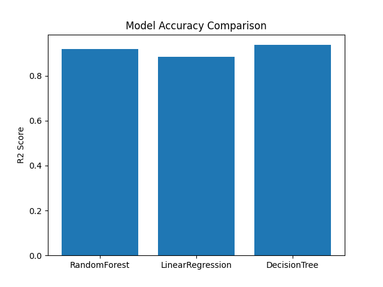

🐄 Veterinary Workforce Demand Forecasting System.

A Machine Learning project to forecast veterinary inspector workforce demand using metaheuristic optimization algorithms and Random Forest regression.

This project compares multiple optimization algorithms and saves models, predictions, metrics, and visualizations automatically.

🚀 Features

✅ Demand prediction using ML
✅ Multiple optimization algorithms
✅ Hybrid optimizer (GWOA)
✅ Automatic graph generation
✅ Automatic result saving
✅ Model export (.pkl, .h5)
✅ Config export (.json, .yaml)
✅ Prediction CSV export
✅ Accuracy comparison

📂 Dataset
Table_10.10_veterniary_inspecors.csv

Contains district-wise veterinary workforce data used for forecasting.

⚙️ Algorithms Implemented
Algorithm	Prefix
Particle Swarm Optimization	pso_
Bat Algorithm	ba_
Crow Search Algorithm	csa_
Artificial Immune System	ais_
Ant Lion Optimizer	aloa_
Dragonfly Algorithm	da_
Harmony Search Algorithm	hsa_
Whale Optimization Algorithm	woa_
Grey Wolf Optimization	gwo_
Hybrid Grey Wolf + Whale	gwoa_
📊 Outputs Generated

Each algorithm generates:

📈 Graphs
Accuracy graph
Heatmap
Test prediction graph
Full prediction graph
📄 CSV Files
Model results
Predictions
🤖 Models
.pkl (sklearn)
.h5 (deep learning)
⚙️ Config Files
.json
.yaml
📁 Example Output (GWOA)
gwoa_model.pkl
gwoa_model.h5
gwoa_model_results.csv
gwoa_predictions.csv
gwoa_accuracy_graph.png
gwoa_heatmap.png
gwoa_test_prediction_graph.png
gwoa_full_prediction_graph.png
gwoa_results.json
gwoa_config.yaml
🧠 Model Workflow
CSV Dataset
     ↓
Data Cleaning
     ↓
Train/Test Split
     ↓
Metaheuristic Optimization
     ↓
Feature Weighting
     ↓
Random Forest Training
     ↓
Prediction
     ↓
Evaluation
     ↓
Save Results + Graphs
📦 Requirements

Install dependencies:

pip install numpy pandas matplotlib seaborn scikit-learn joblib tensorflow pyyaml
▶️ How to Run
Place dataset in:
C:\Users\NXTWAVE\Downloads\Veterinary Workforce Demand Forecasting System\
Run any optimizer script:
python gwoa_model.py

(or pso, ba, woa, etc.)

📊 Evaluation Metrics
R² Score
RMSE
Visual prediction comparison
📈 Graphs Generated
Accuracy comparison
Correlation heatmap
Actual vs predicted (test)
Actual vs predicted (full dataset)
🏆 Best Algorithm Selection

Compare using:

*_model_results.csv

Higher R² and lower RMSE is better.

🧪 Use Cases
Veterinary workforce planning
Government staffing prediction
Agriculture department analytics
Rural infrastructure planning
Resource allocation forecasting
🧑‍💻 Author
Sagnik Patra
